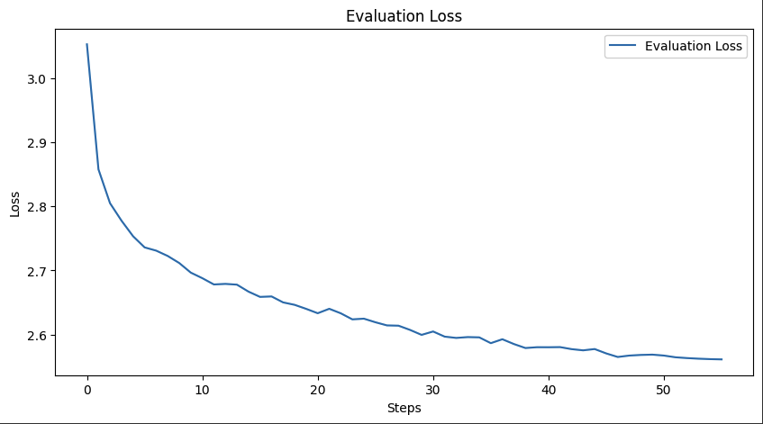

# NewsLens

## Overview
This project aims to develop a  system that automates the news consumption process by combining advanced AI technologies for retrieving, summarizing, and visualizing news content. Our system is designed to streamline the user experience by providing concise summaries and contextually relevant images based on the latest news trends and user interests.

## Model Architecture

### Retrieval-Augmented Generater

Our system utilizes a sophisticated Retrieval-Augmented Generation (RAG) model that combines LangChain and Google Palm LLM to streamline the retrieval and generation of news content. LangChain acts as middleware, facilitating seamless integration between our application and Google Palm LLM, thereby enhancing the LLM's ability to generate accurate prompts from user inputs and contextual information.

After retrieving and summarizing articles, Google Palm LLM, supported by LangChain, creates targeted prompts that capture the essence of the news summaries. These prompts are carefully designed to highlight key themes and visual elements relevant to the news content.

These prompts are fed into Stability.ai’s Stable Diffusion model, which generates images that are visually captivating and contextually synchronized with the text summaries. 

### Multi-Document Summarizer

Initially, the system retrieves top news articles similar to the user query from the FAISS database. Following retrieval, a fine-tuned BART model is employed to condense the content of multiple articles into a single, coherent summary. The BART model adeptly extracts key information and themes from the articles, producing summaries that are concise, informative, and free of bias.

#### ROUGE-2 Metric Scores

#### Loss Curves

### Contextual Image Generater
Stability.ai's Stable Diffusion model is employed to generate images that visually represent the narratives in the news summaries. These images are dynamically created to ensure relevance and engagement.

## Technologies Used
- **FAISS and Instruct Embeddings:** Used to create a vector database for efficient retrieval of news articles.
- **Stability.ai Stable Diffusion:** Generates dynamic and contextually relevant images.
- **Google Palm LLM and Lanchain:** Implements the RAG model for effective prompt generation, enhancing the Stable Diffusion model's output.
- **Streamlit:** Provides an interactive user interface to facilitate easy access and navigation for end-users.
- **BART:** Fine-tuned for multi-document news summarization.

## Integration and Workflow
The components are integrated into a streamlined workflow that ensures efficient data flow and interaction across the system. This automated process enhances the efficiency of news consumption and improves the user experience by providing quick, comprehensive, and visually appealing news summaries.

## Results

